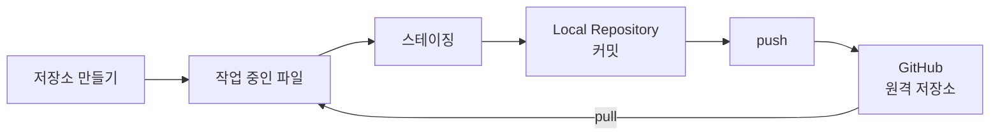
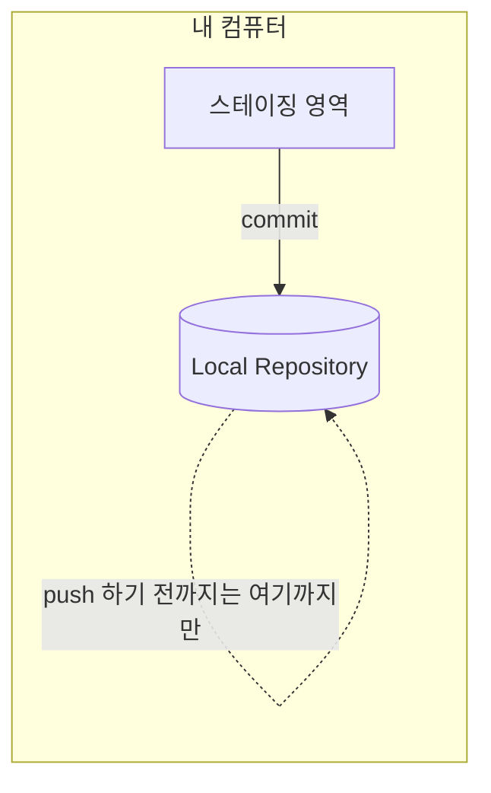
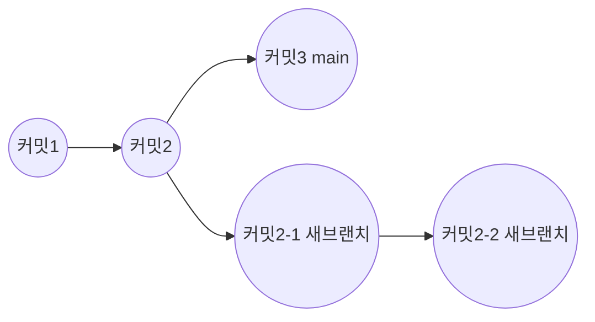
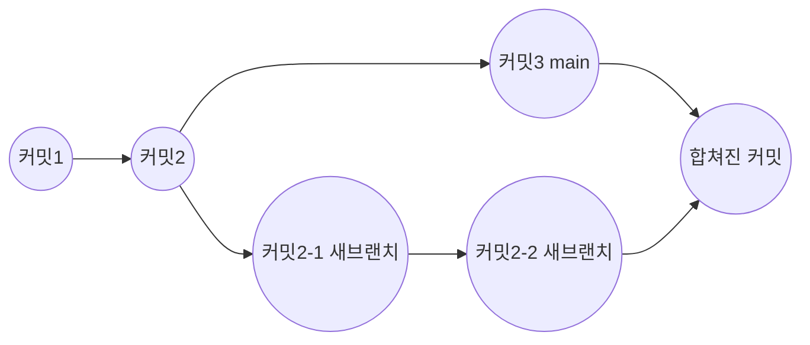
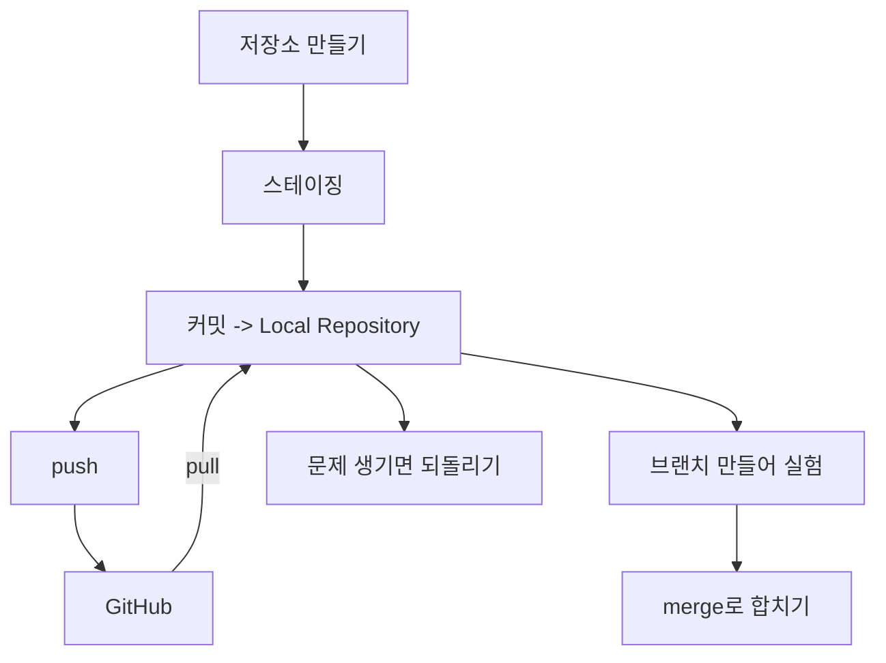

안녕하세요! 이번 주에 Git과 GitHub를 처음 배우고, 직접 블로그도 만들어서 인터넷에 배포까지 해봤죠?
오늘은 이번 주에 배운 내용만 딱 정리해서, 다음에 헷갈릴 때 바로 찾아볼 수 있게 만들어볼게요.

## 1. 전체 흐름 한눈에 보기

Git으로 작업할 때는 아래와 같은 순서로 움직인다고 생각하면 쉬워요.

즉, "저장소를 만들고 → 변경한 파일을 무대에 올리고(스테이징) → 내 컴퓨터 안의 저장소에 기록(커밋)하고 → GitHub로 올린다(push)" 이 흐름이 기본이에요.

## 2. 저장소 만들기

내 프로젝트 폴더를 Git이 관리할 수 있는 "저장소(repository)"로 만드는 단계예요. 여기서부터 모든 게 시작돼요.

|명령어 | 언제 쓰나|
|---|---|
|`git init`| 지금 있는 폴더를 새 Git 저장소로 만들고 싶을 때|

## 3. 스테이징 (Staging)

파일을 수정했다고 바로 기록(커밋)되는 게 아니에요. 먼저 "이번에 기록할 파일이 이거예요"라고 골라주는 과정이 필요한데, 이걸 스테이징이라고 해요.

|명령어 | 언제 쓰나|
|---|---|
|`git add`| 변경한 파일을 커밋에 담을 준비물로 고르고 싶을 때|

## 4. Local Repository (로컬 저장소)

스테이징한 내용을 커밋하면, 그 기록은 내 컴퓨터 안의 저장소인 **Local Repository**에 쌓여요. 아직 인터넷(GitHub)에 올라간 게 아니라, 내 컴퓨터 안에만 저장된 상태예요.

그래서 커밋을 아무리 많이 해도, push를 하기 전까지는 GitHub에 아무 변화가 없어요.

## 5. 커밋 (Commit)

스테이징한 파일들을 하나의 "저장 지점"으로 남기는 게 커밋이에요. 나중에 이 지점으로 언제든 되돌아올 수 있어요.

|명령어 | 언제 쓰나|
|---|---|
|`git commit -m "메시지"`| 스테이징한 내용을 저장 지점(기록)으로 남기고 싶을 때|

## 6. 브랜치 (Branch)

브랜치는 원래 작업 흐름에서 벗어나 "새로운 가지"를 만들어 안전하게 실험해볼 수 있게 해줘요.

|명령어 | 언제 쓰나|
|---|---|
|`git branch`| 지금 어떤 브랜치들이 있는지 보거나, 새 브랜치를 만들고 싶을 때|

## 7. push

내 컴퓨터(Local Repository)에 쌓인 커밋들을 GitHub 같은 원격 저장소로 올려 보내는 명령어예요.

|명령어 | 언제 쓰나|
|---|---|
|`git push`| 로컬에서 만든 커밋을 GitHub에 올리고 싶을 때|

## 8. pull

반대로 GitHub에 있는 최신 내용을 내 컴퓨터로 가져오는 명령어예요.

|명령어 | 언제 쓰나|
|---|---|
|`git pull`| GitHub에 올라온 최신 변경 사항을 내 컴퓨터로 받아오고 싶을 때|

## 9. merge

브랜치에서 따로 작업한 내용을 원래 브랜치(main)로 다시 합치는 거예요.

|명령어 | 언제 쓰나|
|---|---|
|`git merge`| 다른 브랜치에서 작업한 내용을 지금 브랜치에 합치고 싶을 때|

## 10. 되돌리기

실수로 잘못된 커밋을 남겼을 때, 예전 상태로 되돌릴 수 있어요.

|명령어 | 언제 쓰나|
|---|---|
|`git revert`| 특정 커밋의 변경 내용을 취소하는 새 커밋을 만들고 싶을 때|

## 오늘의 정리

이번 주에 배운 걸 순서대로 이어보면 이렇게 흘러가요.

처음엔 용어가 낯설어도, "저장소 만들기 → 스테이징 → 커밋 → push/pull → 브랜치/merge → 되돌리기" 이 순서만 기억하면 앞으로 실습할 때 훨씬 수월할 거예요!
