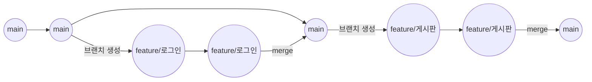
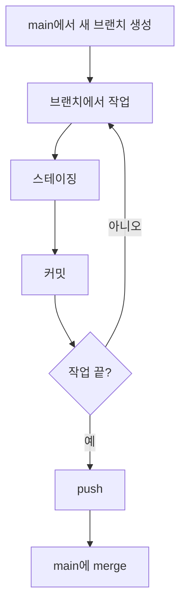

지난번에 머지 충돌을 겪어보면서 "브랜치를 그냥 마음대로 만들고 합치면 안 되는구나"라는 생각이 들었다.
그래서 오늘은 초보자도 바로 써먹을 수 있는 기본적인 **브랜치 전략**을 정리해본다.

## 왜 전략이 필요할까

브랜치 없이 `main` 브랜치 하나에서만 작업하면 이런 문제가 생긴다.

|상황| 문제점|
|---|---|
|여러 작업을 동시에 진행| 어떤 커밋이 어떤 기능 때문인지 구분이 안 됨|
|작업 중인 코드가 망가짐| main이 바로 오염돼서 되돌리기 힘듦|
|여러 명이 같은 파일 수정| 계속 충돌이 남|

그래서 "새 작업은 새 브랜치에서, 다 되면 main에 합친다"는 규칙 하나만 지켜도 훨씬 안전해진다.

## 기본 전략: main + feature 브랜치

가장 기본이 되는 전략은 딱 두 종류의 브랜치만 쓰는 것이다.

- **main**: 항상 안정적으로 동작하는 코드만 있는 브랜치
- **feature 브랜치**: 새로운 기능이나 수정 사항 하나를 작업하는 브랜치 (작업 끝나면 main에 합치고 지움)

이렇게 하면 main은 항상 깨끗하게 유지되고, 실험이나 새 작업은 안전하게 격리된 공간에서 할 수 있다.

## 브랜치 이름 짓는 법

이름만 봐도 무슨 작업인지 알 수 있게 짓는 게 좋다.

|접두사| 언제 쓰나| 예시|
|---|---|---|
|`feature/`| 새로운 기능을 추가할 때| `feature/로그인-기능`|
|`fix/`| 버그를 고칠 때| `fix/충돌-오류`|

## 작업 흐름 단계별 정리

|순서| 하는 일| 명령어|
|---|---|---|
|1| main에서 새 브랜치 생성| `git branch`|
|2| 브랜치에서 작업 후 스테이징| `git add`|
|3| 작업 내용 커밋| `git commit`|
|4| 작업 끝나면 GitHub에 올리기| `git push`|
|5| main에 다시 합치기| `git merge`|

전체 흐름을 그림으로 보면 이렇다.

## 이 전략이 충돌을 줄여주는 이유

- 작업 단위가 브랜치별로 나뉘어 있어서, 같은 줄을 동시에 건드릴 확률이 줄어든다.
- 브랜치를 오래 붙잡고 있지 않고 빨리 합칠수록, main과 내 브랜치의 차이가 작아져서 충돌 가능성도 낮아진다.
- 합치기 전에 main의 최신 내용을 `git pull`로 미리 받아두면, 충돌을 미리 발견하고 대비할 수 있다.

## 정리

오늘 배운 건 결국 한 문장이다.

> "새 작업은 새 브랜치에서 시작하고, 끝나면 main에 합친 뒤 브랜치는 지운다."

지난번 충돌 경험 때문에 막연히 브랜치가 무섭게 느껴졌는데, 규칙을 정해두고 쓰니까 오히려 더 안전하다는 걸 알게 됐다.
