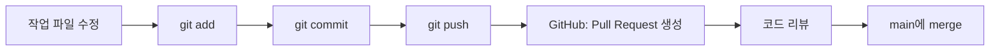
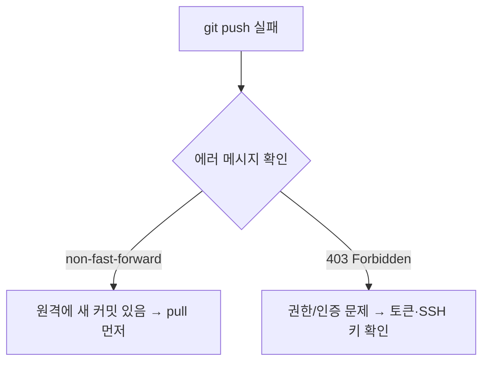

오늘은 git으로 작업할 때 가장 많이 쓰는 네 가지, **commit / push / pull / PR**을 정리해본다.
계기는 push를 하다가 충돌이 났는데, 그 자리에서 `403` 에러까지 같이 떠서 둘이 무슨 관계인지 헷갈렸기 때문이다.

## 네 가지가 각각 하는 일

|명령/개념| 하는 일| 어디서 일어나나|
|---|---|---|
|`git commit`| 지금까지 변경한 내용을 하나의 기록으로 저장| 내 컴퓨터 (로컬)|
|`git push`| 로컬에 쌓인 커밋을 원격 저장소(GitHub)에 올림| 로컬 → 원격|
|`git pull`| 원격 저장소의 최신 내용을 내 로컬로 받아옴| 원격 → 로컬|
|PR (Pull Request)| "내 브랜치 내용을 main에 합쳐도 될지" 리뷰를 요청하는 것| GitHub 상에서|

즉 commit은 "저장", push는 "업로드", pull은 "다운로드", PR은 "합쳐도 되는지 물어보는 절차"라고 이해하면 된다.

## 충돌이 났는데 왜 403이 뜰까?

이번에 겪은 상황은 이랬다.

1. 원격 저장소에 내가 모르는 새 커밋이 이미 올라가 있는 상태에서
2. 그걸 모르고 `git push`를 했더니 뭔가 에러가 났고
3. 그 메시지 중에 `403`이 보였다.

여기서 헷갈렸던 부분은 **충돌(conflict)과 403은 원인이 서로 다르다**는 점이다.

|에러| 진짜 원인| 해결 방법|
|---|---|---|
|`! [rejected] (non-fast-forward)`| 원격에 내가 안 받은 커밋이 있어서 생기는 진짜 "충돌" 상황| `git pull`로 먼저 받은 뒤 충돌 해결하고 다시 push|
|`403 Forbidden`| 인증/권한 문제 (푸시할 권한이 없거나, 로그인 정보가 잘못됨)| 원격 저장소 권한 확인, 개인 접근 토큰(PAT)이나 SSH 키 다시 설정|

즉 403은 "브랜치 내용이 충돌해서" 나는 에러가 아니라, **애초에 이 저장소에 push할 자격이 없다고 GitHub가 거절하는 것**에 가깝다. 두 에러가 비슷한 타이밍에 같이 나타나서 하나의 문제처럼 느껴졌지만, 사실은 별개의 문제였다.

## 정리

- **commit**: 로컬에 변경 내용을 기록
- **push**: 로컬 커밋을 원격에 반영
- **pull**: 원격의 최신 내용을 로컬로 반영
- **PR**: push한 브랜치를 main에 합쳐도 되는지 리뷰 요청

오늘의 핵심 교훈은, **"충돌 에러"와 "403 권한 에러"는 다른 문제라서 각각 다르게 대응해야 한다**는 것이다. push가 거절됐을 때 무조건 pull부터 하지 말고, 에러 메시지를 먼저 제대로 읽는 습관을 들여야겠다.
