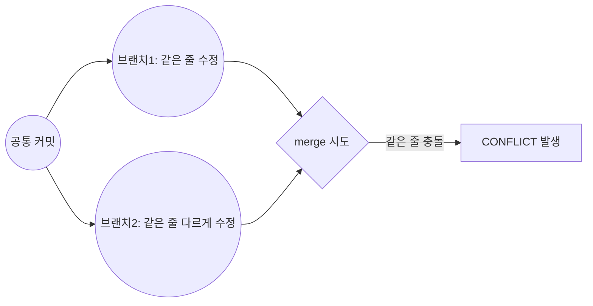

지난주에 Git과 GitHub를 처음 배우면서, "머지 충돌(merge conflict)"이라는 걸 처음 경험했다.
결론부터 말하면 정말 당황스러웠다. 오늘은 그때 무슨 일이 있었고, 뭘 배웠고, 앞으로 뭘 더 알고 싶은지 일지처럼 남겨보려 한다.

## 무슨 일이 있었나?

브랜치를 나눠서 각자(혹은 나 혼자 여러 브랜치로) 같은 파일의 같은 부분을 수정한 다음, `git merge`로 합치려고 했다.
그런데 화면에 이런 에러가 떴다. 

```
Auto-merging 파일명
CONFLICT (content): Merge conflict in 파일명
Automatic merge failed; fix conflicts and then commit the result.
```

처음 보는 문구라 "내가 뭘 잘못 눌렀나?", "아 망했네.." 싶어서 순간 멘붕이 오고 말았다...🤯🤯

## 머지 충돌이 뭔지?

나처럼 처음 배우는 사람을 위해 쉽게 설명해보면 이렇다.

Git은 두 브랜치를 합칠 때, 서로 다른 부분을 고친 거라면 알아서 잘 합쳐준다.
하지만 **같은 파일의 같은 줄을 서로 다르게 고쳤다면**, Git은 "둘 중 뭘 남겨야 할지 저는 모르겠어요, 사람이 정해주세요"라며 멈춰버린다. 이게 바로 머지 충돌이다.



## 충돌이 난 파일을 열어보니?!

파일을 열어보니 이런 이상한 기호들이 껴 있었다.

```
<<<<<<< HEAD
내 브랜치에서 고친 내용
=======
합치려는 브랜치에서 고친 내용
>>>>>>> 브랜치이름
```

처음엔 이 기호들이 뭔지 몰라서 그냥 지워야 하나, 파일이 깨진 건가 싶었다. 나중에 찾아보고 나서야 이해했다.

|기호| 의미|
|---|---|
|`<<<<<<< HEAD`| 여기부터 "내 쪽(현재 브랜치)" 내용 시작|
|`=======`| 기준선, 여기부터는 "합치려는 쪽" 내용|
|`>>>>>>> 브랜치이름`| "합치려는 쪽" 내용 끝|

## 어떻게 해결했나?

1. 충돌 표시가 된 부분을 직접 눈으로 읽고, 어떤 내용을 남길지 손으로 골랐다.
2. `<<<<<<<`, `=======`, `>>>>>>>` 기호들은 전부 지우고, 최종적으로 남기고 싶은 코드만 남겼다.
3. 수정한 파일을 다시 스테이징(`git add`)했다.
4. 커밋해서 머지를 마무리했다.

말로는 4줄이지만, 실제로는 "이 기호가 뭐지", "지워도 되는 건가", "둘 다 살려야 하나 하나만 살려야 하나"를 하나씩 검색해가며 진행해서 시간이 꽤 걸렸다.

## 이번에 배우게 된 것

- 머지 충돌은 Git이 고장난 게 아니라, "네가 직접 결정해줘"라는 신호라는 것
- 충돌 파일 안의 `<<<<<<<`, `=======`, `>>>>>>>` 기호가 각각 무슨 뜻인지
- 충돌을 해결한 뒤에도 결국 `git add` → `git commit` 순서로 마무리해야 머지가 끝난다는 것

## STAR로 이번 경험 정리해보기

경험을 글로 남길 때 쓰기 좋은 방법 중에 **STAR 기법**이라는 게 있다고 해서 처음 써봤다.
"어떤 상황에서, 무슨 과제가 있었고, 내가 뭘 했고, 결과가 어땠는지"를 4단계로 나눠서 정리하는 방법이다.

|단계| 의미| 이번 경험에 적용해보면|
|---|---|---|
|**S**ituation (상황)| 어떤 상황이었나| 브랜치를 나눠서 같은 파일의 같은 부분을 서로 다르게 수정한 뒤, `git merge`로 합치려던 상황|
|**T**ask (과제)| 그때 해결해야 했던 문제| 처음 보는 `CONFLICT` 에러와 `<<<<<<<` 기호를 이해하고, 머지를 정상적으로 끝마쳐야 했음|
|**A**ction (행동)| 내가 실제로 한 행동| 충돌 기호의 의미를 찾아보고, 두 내용 중 남길 걸 직접 골라 수정한 뒤 `git add`, `git commit`으로 머지를 마무리함|
|**R**esult (결과)| 그래서 어떻게 됐나| 충돌을 스스로 해결하는 데 성공했고, 충돌 화면을 봐도 더 이상 당황하지 않게 됨|

이렇게 나눠서 써보니, 그냥 "힘들었다"로 끝날 뻔한 경험이 "무슨 상황에서, 뭘 했고, 뭘 얻었는지"가 뚜렷하게 보여서 좋았다. 다음에 다른 경험을 정리할 때도 이 틀을 써봐야겠다.

## 아직 어려운 것 / 앞으로 알고 싶은 것

- 애초에 충돌이 안 나게 작업하는 방법(예: 자주 pull 받기, 브랜치를 짧게 유지하기)이 있는지
- 충돌 파일이 여러 개일 때 어떤 순서로 처리하는 게 좋은지
- VS Code 같은 에디터에는 충돌을 더 편하게 볼 수 있는 화면이 있다던데, 그건 어떻게 쓰는지
- 팀으로 협업할 때는 충돌이 나면 누구랑 어떻게 상의해서 정하는 게 좋은지(이게 사실상 제일 중요하다 왜냐? 내가 너무 못하기 때문에)


오늘은 여기까지다. 처음이라 엄청 흔들렸지만, 충돌 화면을 봐도 더 이상 패닉하지 않을 것 같다는 게 이번 주 제일 큰 수확이다 ㅋㅎㅋㅎ
